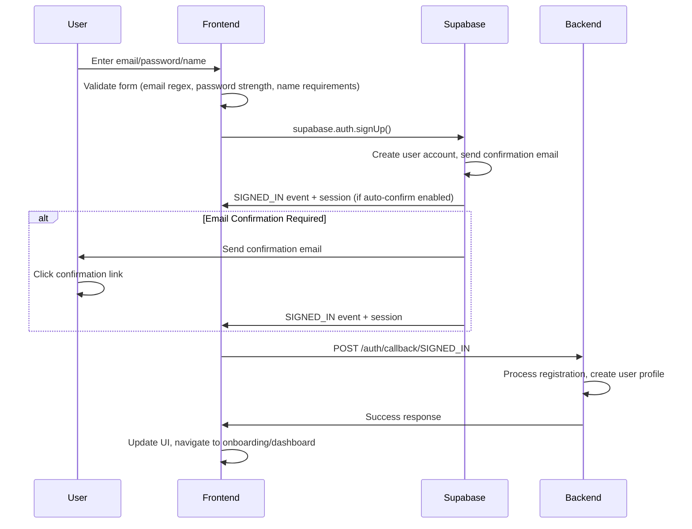
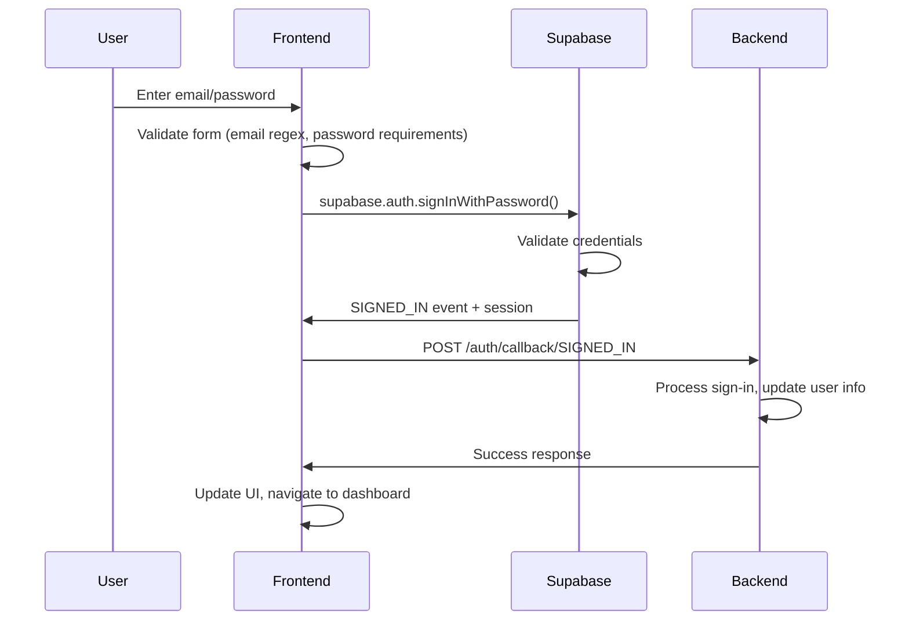
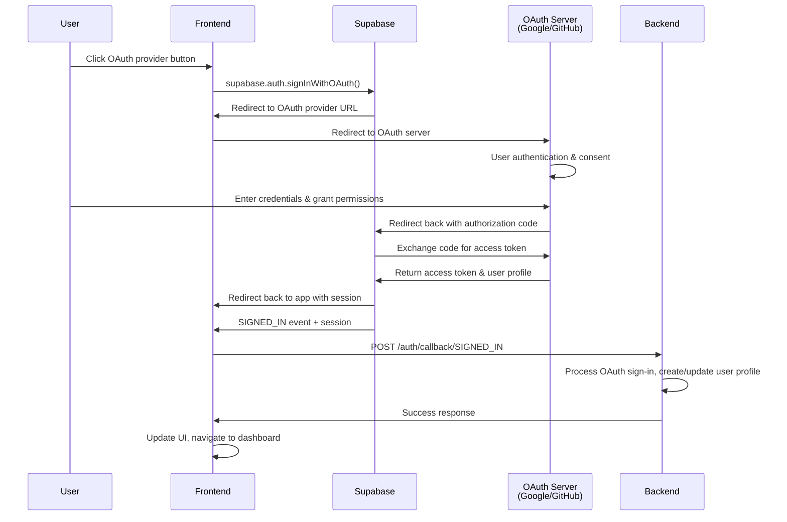
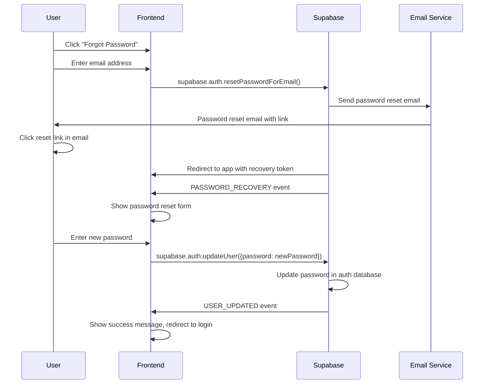
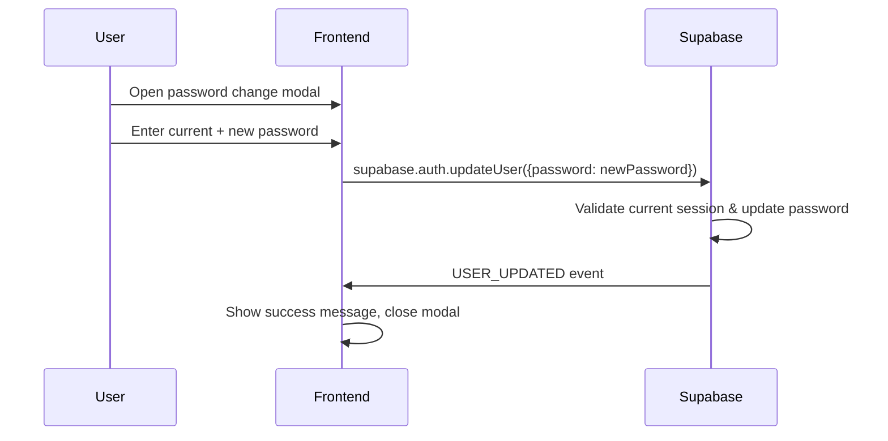
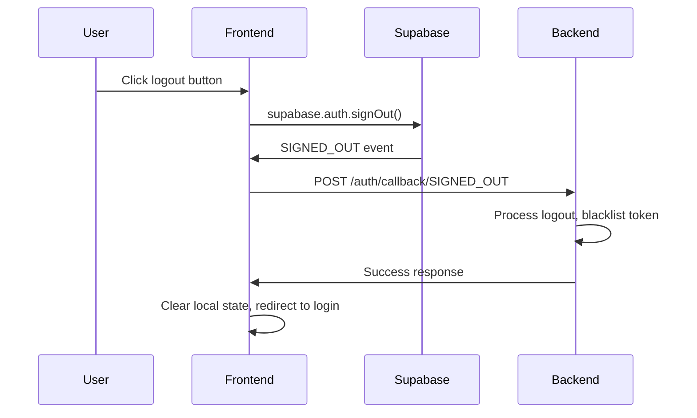
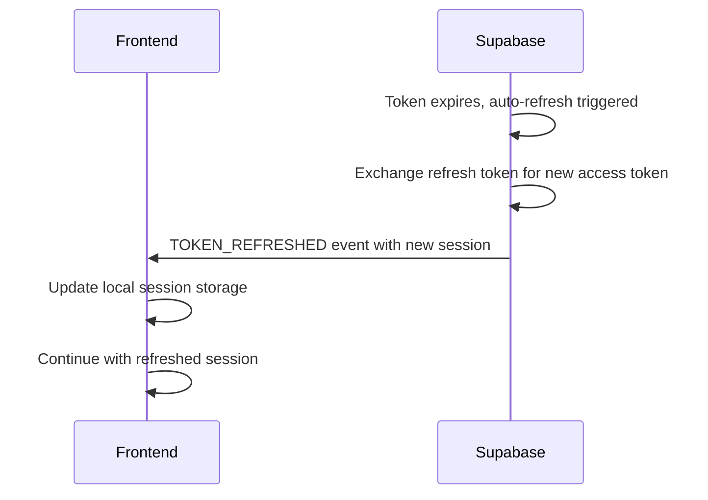
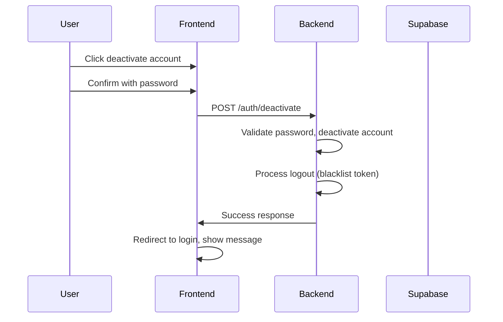

# Authentication Flow Documentation

> **Note**: This document supersedes `auth_sequence.md` which contained basic sequence diagrams. All authentication flows, including comprehensive sequence diagrams, are now documented here.

## Overview

The Faster framework implements a comprehensive authentication system using Supabase Auth with a hybrid frontend/backend integration. The system supports multiple authentication methods including email/password, OAuth providers (Google, GitHub), and advanced features. Password operations and token refresh are handled directly by Supabase Auth server, while user management and session events are processed through the FastAPI backend.

## Architecture Components

### Frontend (JavaScript/Alpine.js)
- **Location**: `faster/resources/dev-admin.html`
- **Responsibilities**:
  - User interface for authentication forms
  - Supabase client integration
  - Form validation and error handling
  - Authentication state management

### Backend (FastAPI)
- **Location**: `faster/core/auth/routers.py`
- **Responsibilities**:
  - Authentication event handling and callbacks
  - User session management and blacklisting
  - Account management and administrative operations
  - User profile and role management

**Note:** Password operations (change/reset) are now handled directly by Supabase Auth server via frontend client.

### Supabase Auth Events
The system handles the following Supabase authentication events:

| Event | Description | Endpoint |
|-------|-------------|----------|
| `INITIAL_SESSION` | Emitted when Supabase client initializes | `/auth/notification/INITIAL_SESSION` |
| `SIGNED_IN` | User successfully signs in | `/auth/callback/SIGNED_IN` |
| `SIGNED_OUT` | User signs out | `/auth/callback/SIGNED_OUT` |
| `TOKEN_REFRESHED` | Access token is refreshed | *(Handled by Supabase client only)* |
| `USER_UPDATED` | User profile is updated | `/auth/callback/USER_UPDATED` or `/auth/notification/USER_UPDATED` |
| `PASSWORD_RECOVERY` | Password recovery initiated | `/auth/notification/PASSWORD_RECOVERY` |

## Authentication Flows

### 1. User Registration Flow (Email/Password)

**Key Points:**
- Form validation includes email regex, password strength, and name requirements
- Supabase handles user creation and email confirmation
- Backend processes the sign-in event and creates additional user profile data
- For developer users, available roles are cached during registration
- Supports both auto-confirmation and email confirmation flows

### 2. Email/Password Login Flow

**Key Points:**
- Form validation includes email regex and password strength requirements
- Backend removes token from blacklist and updates user database info
- For developer users, available roles are cached

### 3. OAuth Login Flow (Google/GitHub)

**Key Points:**
- Uses OAuth 2.0 authorization code flow
- Supports Google and GitHub providers
- Supabase handles OAuth redirect and token exchange
- Backend processes the sign-in event and manages user profile data
- Same backend processing as email/password login

### 4. Password Reset Flow

**Key Points:**
- Frontend directly calls Supabase Auth server for password reset
- Email contains reset link that redirects back to the app
- Password update happens directly with Supabase using recovery token
- No backend server involvement in the password reset process
- Uses Supabase's built-in password reset functionality

### 5. Password Change Flow (Authenticated User)

**Key Points:**
- Frontend directly calls Supabase Auth server for password changes
- Requires active authenticated session
- Supabase handles password validation and update
- No backend server involvement for password changes

### 6. Logout Flow

**Key Points:**
- Backend adds token to blacklist for security
- Clears saved page navigation state
- Redirects to authentication view

### 7. Token Refresh Flow

**Key Points:**
- Automatic process handled entirely by Supabase client
- No user interaction or backend server involvement
- Frontend receives new session data automatically
- Maintains session continuity transparently

### 8. UserDeactivation Flow

**Key Points:**
- Requires password confirmation
- Performs comprehensive account deactivation
- Automatic logout after deactivation

## API Endpoints Reference

### Authenticated Callback Endpoints (`/auth/callback/{event}`)
These endpoints require authentication and handle events during active sessions:

- **POST** `/auth/callback/SIGNED_IN` - Process successful sign-in
- **POST** `/auth/callback/SIGNED_OUT` - Process sign-out
- **POST** `/auth/callback/USER_UPDATED` - Process profile updates

**Note:** Token refresh is now handled automatically by Supabase client without backend involvement.

### Public Notification Endpoints (`/auth/notification/{event}`)
These endpoints are public and handle events that occur without active sessions:

- **POST** `/auth/notification/INITIAL_SESSION` - Initial session setup
- **POST** `/auth/notification/PASSWORD_RECOVERY` - Password recovery initiated
- **POST** `/auth/notification/USER_UPDATED` - Password reset completion

### Password Management Endpoints

- **POST** `/auth/password/reset/initiate` - Initiate password reset (public, legacy)
- **POST** `/auth/password/reset/confirm` - Confirm password reset (public, legacy)

**Note:** Password changes and resets are now handled directly by Supabase Auth server via frontend Supabase JS client. Backend endpoints are maintained for legacy support but are not actively used in current flows.

### Account Management Endpoints

- **GET** `/auth/profile` - Get user profile (authenticated)
- **POST** `/auth/deactivate` - Deactivate account (authenticated)

### Administrative Endpoints

- **POST** `/auth/users/{user_id}/ban` - Ban user (admin)
- **POST** `/auth/users/{user_id}/unban` - Unban user (admin)
- **POST** `/auth/users/{user_id}/roles/adjust` - Adjust user roles (admin)
- **GET** `/auth/users/{user_id}/basic` - Get user basic info (admin)

## Security Features

### Token Blacklisting
- Tokens are blacklisted on logout for security
- Refreshed tokens are removed from blacklist
- Prevents use of old tokens

### Session Management
- Automatic token refresh handled by Supabase client
- Session validation on app initialization
- Proper cleanup on logout

### Password Security
- Strong password requirements for sign-up
- Current password verification for changes
- Secure password reset flow

### Role-Based Access Control (RBAC)
- Dynamic role assignment
- Tag-based endpoint protection
- Administrative user management

## Error Handling

### Frontend Error Handling
- Form validation with user-friendly messages
- Toast notifications for auth events
- Loading states during operations
- Automatic retry for failed requests

### Backend Error Handling
- Comprehensive logging of auth events
- Graceful handling of Supabase failures
- Proper error responses to frontend
- Background task processing for reliability

## Event Logging

All authentication events are logged to the database with the following information:
- Event type and name
- User ID (when available)
- Timestamp
- Event source (supabase/user_action/admin_action)
- Additional payload data

This provides comprehensive audit trails for security and debugging purposes.