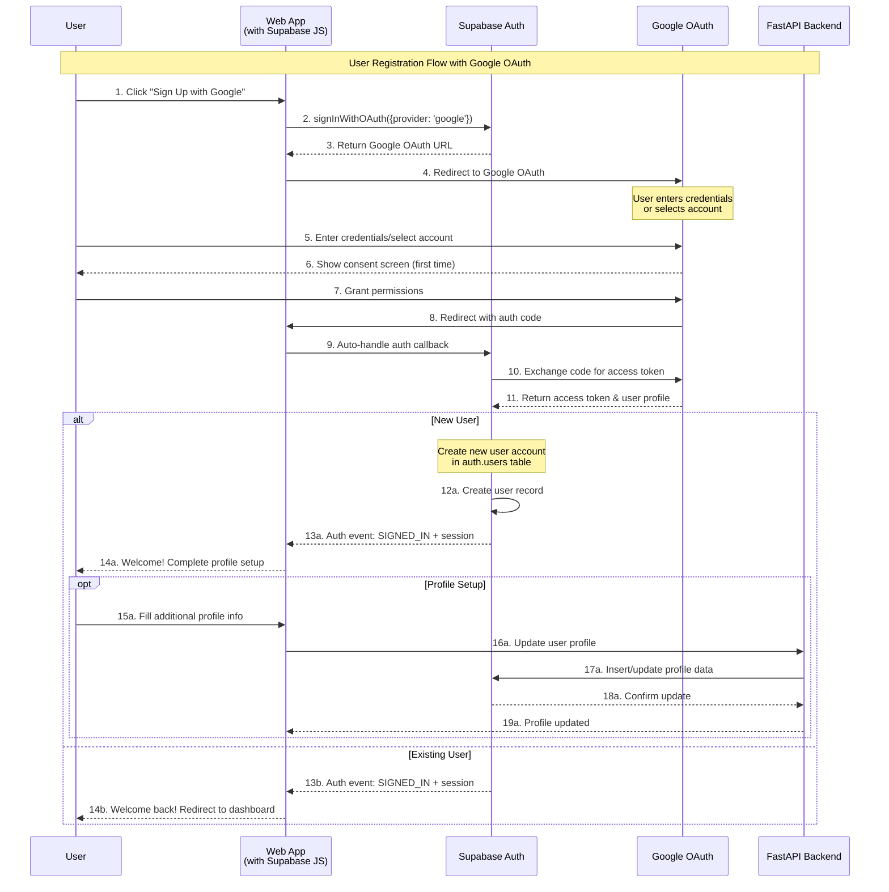
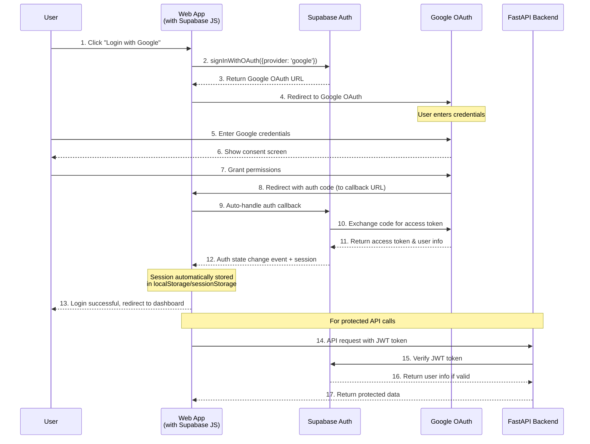
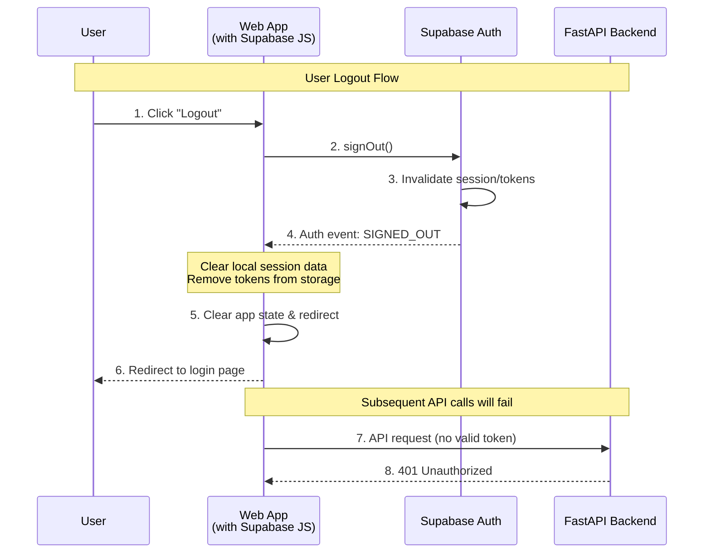

## Sequence Diagram with Supabase Auth

### 1, User Registration Flow

Shows how new and existing users are handled differently during Google OAuth registration



Client side code for user registration flow (React/Vue/vanilla JS):

```javascript
// Registration is identical to login with OAuth
const { data, error } = await supabase.auth.signInWithOAuth({
  provider: "google",
  options: {
    redirectTo: "http://localhost:3000/onboarding", // Different redirect for new users
  },
});
// Listen for auth state to handle new vs returning users
supabase.auth.onAuthStateChange(async (event, session) => {
  if (event === "SIGNED_IN") {
    // Check if user needs onboarding
    const { data: profile } = await supabase
      .from("profiles")
      .select("*")
      .eq("id", session.user.id)
      .single();

    if (!profile) {
      // New user - redirect to onboarding
      router.push("/onboarding");
    } else {
      // Existing user - redirect to dashboard
      router.push("/dashboard");
    }
  }
});
```

### 2, User Login Flow

Shows how new and existing users are handled differently during Google OAuth login



Client side code for user login flow (React/Vue/vanilla JS):

```javascript
import { createClient } from "@supabase/supabase-js";

const supabase = createClient("your-url", "your-anon-key");

// Login with Google
async function loginWithGoogle() {
  const { data, error } = await supabase.auth.signInWithOAuth({
    provider: "google",
    options: {
      redirectTo: "http://localhost:3000/dashboard",
    },
  });
}

// Listen for auth changes
supabase.auth.onAuthStateChange((event, session) => {
  if (event === "SIGNED_IN") {
    // User is logged in, session contains JWT
    console.log("User logged in:", session.user);
  }
});
```

### 3, User Logout Flow

Show to logout of Supabase and FastAPI



Client-side code for handling auth state changes (React/Vue/vanilla JS):

```javascript
// Simple logout
async function logout() {
  const { error } = await supabase.auth.signOut();
  if (!error) {
    // Supabase automatically clears local storage
    // Redirect to login page
    router.push("/login");
  }
}
```
