# 🐳 Docker Integration Guide - Streamlined Testing & Deployment

## 🎯 **Overview**

Your Docker setup provides **powerful capabilities** that enhance both testing and deployment workflows, working alongside the native Python Workers deployment to give you **maximum flexibility**.

## 🏗️ **Docker Integration Architecture**

```mermaid
graph TB
    A[Developer] -->|Local Dev| B[Docker Compose]
    A -->|Push Code| C[GitHub Repository]

    C -->|Workers Deploy| D[Native Python Workers]
    C -->|Docker Deploy| E[Docker Pipeline]

    D -->|Fast Edge| F[Cloudflare Workers]
    E -->|Traditional Cloud| G[AWS/GCP/Azure]

    B -->|Testing| H[docker-compose.test.yml]
    H -->|Validate| I[Pre-deployment Checks]
    I -->|✅ Verified| D
    I -->|✅ Verified| E

    J[CI/CD] -->|Matrix Testing| K[Native + Docker Tests]
    K -->|Both Pass| D
    K -->|Both Pass| E
```



## 🚀 **Key Benefits**

### **🧪 Enhanced Testing**
- **🔄 Consistent Environment**: Docker ensures identical testing conditions
- **🎯 Isolated Testing**: Separate test database and Redis instances
- **🐳 Production-Like**: Test in containerized environment before deployment
- **⚡ CI/CD Matrix**: Run both native and Docker-based tests in parallel

### **🚀 Flexible Deployment Options**
- **🌍 Workers First**: Fast edge deployment with Python Workers (primary)
- **☁️ Cloud Backup**: Traditional cloud deployment via Docker (secondary)
- **🔄 Hybrid Strategy**: Deploy to both platforms simultaneously
- **📊 A/B Testing**: Compare performance across platforms

### **🛠️ Development Workflow**
- **📦 Full Stack Local**: Complete environment with PostgreSQL + Redis + Supabase
- **🔧 Easy Setup**: One command local development
- **🐛 Debug Production Issues**: Reproduce issues in identical environment

---

## 🎯 **Testing Workflows**

### **🧪 Local Testing with Docker**

```bash
# Start complete testing environment
make docker-test-up

# Run tests in Docker
make test-docker

# Run E2E tests in Docker
make test-e2e-docker

# Validate deployment readiness
make validate-deployment

# Clean up
make docker-test-down
```

### **🔍 Development Debugging**

```bash
# Start test environment
make docker-test-up

# Open shell in test container
make docker-test-shell

# Execute specific commands
make docker-test-exec cmd="make lint"
make docker-test-exec cmd="alembic upgrade head"

# View logs
make docker-test-logs

# Reset environment
make docker-test-reset
```

### **🤖 CI/CD Integration**

The enhanced GitHub Actions workflow runs **matrix testing**:

```yaml
strategy:
  matrix:
    test-method: [native, docker]
```

**Benefits:**
- **🎯 Native Tests**: Fast execution with GitHub Actions services
- **🐳 Docker Tests**: Production-like environment validation
- **📊 Comprehensive**: Catch environment-specific issues
- **🔄 Parallel Execution**: Both run simultaneously

---

## 🚀 **Deployment Strategies**

### **1. 🌟 Workers-First Strategy (Recommended)**

```bash
# Deploy to Cloudflare Workers (primary)
make tag-release version=v1.0.0

# Automatic deployment to:
# - Development: faster-app-dev.workers.dev
# - Staging: faster-app-staging.workers.dev (pre-release)
# - Production: faster-app-prod.workers.dev (stable)
```

**Use for**: Fast global edge deployment, serverless scaling

### **2. 🐳 Docker-Only Strategy**

```bash
# Deploy via Docker to cloud providers
make tag-docker-release version=v1.0.0

# Triggers Docker pipeline to:
# - Build multi-arch container images
# - Push to GitHub Container Registry
# - Deploy to configured cloud provider
```

**Use for**: Traditional cloud infrastructure, specific compliance needs

### **3. 🔄 Hybrid Strategy**

```bash
# Deploy to both platforms
make deploy-hybrid

# Or deploy separately:
make tag-release version=v1.0.0        # Workers
make tag-docker-release version=v1.0.0 # Docker
```

**Use for**: A/B testing, migration scenarios, redundancy

---

## 🔧 **Configuration Files**

### **📁 Docker Compose Files**

| File | Purpose | Use Case |
|------|---------|----------|
| `docker-compose.yml` | Basic development | Local development with SQLite + Redis |
| `docker-compose-full.yml` | Complete stack | Full Supabase + Traefik + production-like |
| `docker-compose.test.yml` | Testing environment | Isolated testing with in-memory SQLite |

### **🚀 GitHub Workflows**

| File | Purpose | Trigger |
|------|---------|---------|
| `deploy.yml` | Python Workers deployment | `v*.*.*` tags |
| `docker-deploy.yml` | Docker deployment | `docker-v*.*.*` tags |

---

## 🛠️ **Local Development Setup**

### **🚀 Quick Start**

```bash
# Option 1: Standard development
make docker-up                    # SQLite + Redis (fast and simple)
make run                         # FastAPI on localhost:8000

# Option 2: Full stack development
make docker-full-up              # Complete stack with Traefik + Supabase
# Access: http://app.localhost (via Traefik)

# Option 3: Testing environment
make docker-test-up              # Isolated testing with in-memory SQLite
# Access: http://localhost:8001
```

### **🔄 Development Workflow**

```bash
# 1. Start development environment (SQLite + Redis)
make docker-up

# 2. Run your FastAPI app
make run

# 3. Make changes and test
make test                        # Quick native tests
make test-docker                # Full Docker tests (with SQLite)

# 4. Validate before deployment
make validate-deployment        # Complete validation

# 5. Deploy when ready
make tag-release version=v1.0.0  # Cloudflare Workers
# OR
make tag-docker-release version=v1.0.0  # Docker deployment
```

---

## 🧪 **Testing Strategy Comparison**

| Testing Method | Speed | Environment | Use Case |
|----------------|-------|-------------|----------|
| **Native Tests** | ⚡ Fast | GitHub Actions | Quick feedback, development |
| **Docker Tests** | 🐳 Moderate | Production-like | Pre-deployment validation |
| **E2E Tests** | 🎭 Slow | Browser + Full Stack | User journey validation |

### **🎯 When to Use Each**

- **Native Tests**: Every commit, quick development feedback
- **Docker Tests**: Before deployment, environment validation
- **E2E Tests**: Major features, release validation

---

## ☁️ **Cloud Deployment Options**

### **🚀 Supported Platforms**

Your Docker setup can deploy to:

- **AWS**: ECS, Fargate, App Runner
- **Google Cloud**: Cloud Run, GKE
- **Azure**: Container Instances, Container Apps
- **DigitalOcean**: App Platform, Kubernetes
- **Any Docker-compatible platform**

### **🔧 Configuration**

Set repository variables:
```bash
# GitHub Repository Settings > Variables
CLOUD_PROVIDER=aws              # aws, gcp, azure, digitalocean
DEPLOYMENT_URL=https://your-app.example.com
```

### **🔐 Required Secrets**

Depending on your cloud provider, set:
```bash
# AWS
AWS_ACCESS_KEY_ID
AWS_SECRET_ACCESS_KEY

# Google Cloud
GCP_SA_KEY

# Azure
AZURE_CREDENTIALS

# DigitalOcean
DIGITALOCEAN_ACCESS_TOKEN
```

---

## 📊 **Performance Comparison**

| Platform | Cold Start | Scalability | Cost | Global Edge |
|----------|------------|-------------|------|-------------|
| **Cloudflare Workers** | ~0ms | Unlimited | Pay-per-request | ✅ Yes |
| **Docker on AWS** | ~1-10s | High | Reserved instances | ❌ Regional |
| **Docker on GCP** | ~1-5s | High | Pay-per-use | ❌ Regional |

### **🎯 Platform Selection Guide**

- **Choose Workers** for: Maximum performance, global edge, serverless scaling
- **Choose Docker** for: Specific infrastructure needs, compliance requirements, existing cloud investments

---

## 🔍 **Monitoring & Health Checks**

### **📊 Built-in Health Checks**

All Docker configurations include:
```dockerfile
HEALTHCHECK --interval=30s --timeout=3s \
    CMD curl -f http://localhost:8000/health || exit 1
```

### **🏥 Health Check Script**

```bash
# Check any deployment
./scripts/health-check.sh localhost:8001          # Docker local
./scripts/health-check.sh development             # Workers dev
./scripts/health-check.sh your-app.example.com    # Docker cloud
```

### **📈 Monitoring Integration**

- **Docker**: Integrates with cloud provider monitoring
- **Workers**: Built-in Cloudflare Analytics + custom metrics
- **Both**: Support Sentry error tracking

---

## 🚀 **Migration & Rollback**

### **🔄 Platform Migration**

```bash
# Migrate from Docker to Workers
1. make tag-release version=v1.0.0     # Deploy to Workers
2. Test Workers deployment
3. Update DNS to Workers
4. Scale down Docker deployment

# Migrate from Workers to Docker
1. make tag-docker-release version=v1.0.0  # Deploy to Docker
2. Test Docker deployment
3. Update DNS to Docker
4. Keep Workers as backup
```

### **⚡ Emergency Rollback**

```bash
# Workers rollback (fast)
git tag -d v1.2.0
git push origin --delete v1.2.0
make tag-release version=v1.1.0

# Docker rollback (via cloud provider)
# Specific to your cloud provider's rollback mechanism
```

---

## 📝 **Best Practices**

### **✅ Development Practices**

1. **🧪 Test Locally First**: Use `make docker-test-up` before pushing
2. **🔄 Validate Both**: Run both native and Docker tests
3. **🎯 Environment Parity**: Keep Docker configs in sync
4. **📊 Monitor Deployments**: Set up health check alerts

### **🚀 Deployment Practices**

1. **📋 Pre-deployment Validation**: Always run `make validate-deployment`
2. **🏷️ Proper Tagging**: Use semantic versioning for all deployments
3. **🔍 Health Checks**: Verify deployments with automated health checks
4. **📊 Gradual Rollouts**: Use staging environments before production

### **🛡️ Security Practices**

1. **🔐 Secret Management**: Never commit secrets to Docker configs
2. **🐳 Image Security**: Regularly update base images
3. **🔒 Network Isolation**: Use proper Docker networking
4. **📋 Least Privilege**: Run containers with non-root users

---

## 🎉 **Conclusion**

Your Docker integration provides **powerful flexibility**:

- **🧪 Enhanced Testing**: Comprehensive validation in production-like environments
- **🚀 Deployment Options**: Choose the best platform for your needs
- **🔄 Hybrid Strategy**: Deploy to both edge and traditional cloud
- **🛠️ Developer Experience**: Consistent local development environment

**Recommendation**: Use **Workers as primary** for performance and **Docker as backup** for specific needs or migration scenarios.

---

*Updated: September 2024 - Integrated with native Python Workers deployment*